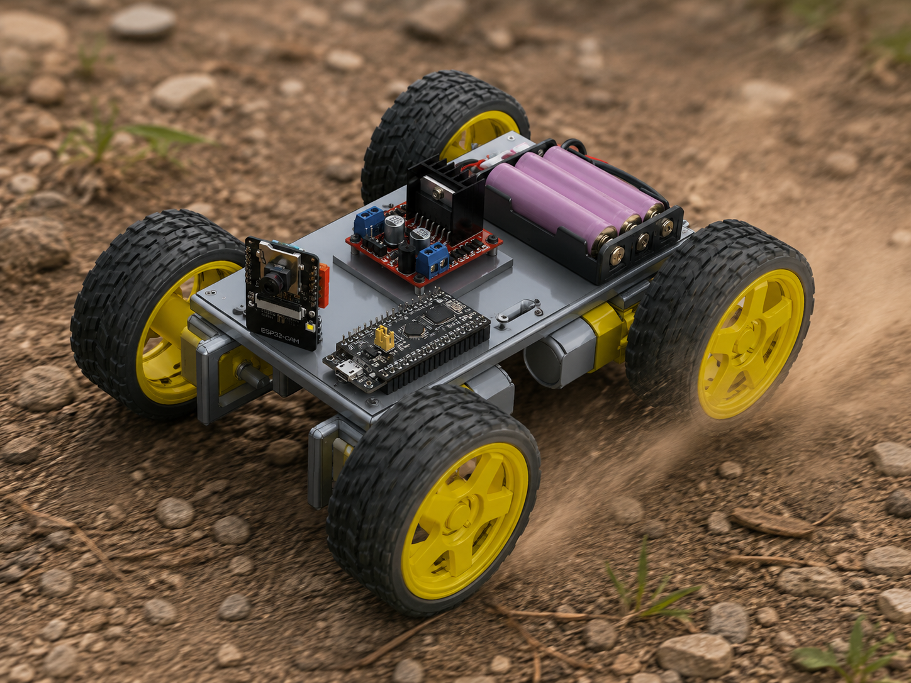
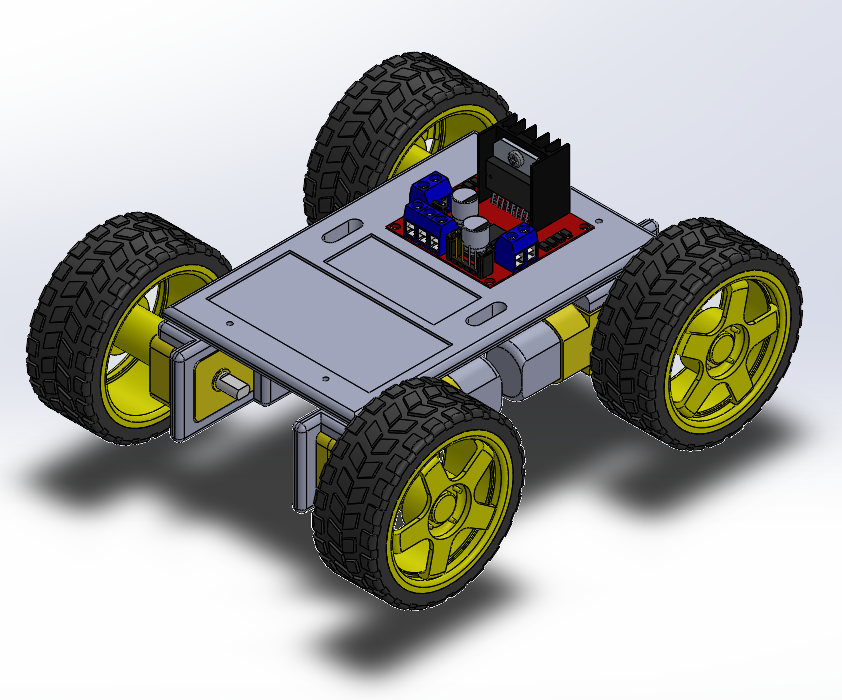
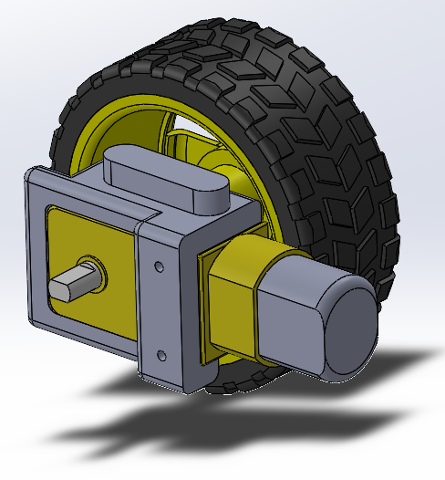

# ADEPCUR-R0 (Ñandú)

Chasis de prototipo para ROVER - Modelo 0 (Ñandú) 

Contenido
---------

- [x] Archivos SOLIDWORKS 2020.
- [x] STL (IMPORTANTE: al ser WIP, verificar que estén actualizados antes de imprimir).

Piezas
------

- 2x Soporte motor 1 (izquierda)
- 2x Soporte motor 2 (derecha)
- 1x Chasis

### Chasis

- Alojamiento para L298N, 3x baterías 18650, y placas adicionales (BMS, DCDC, etc.).
- 4x slots para colocar una placa superior con electrónica de control / misión (Blackpill, ESP32CAM, etc.).

### Soporte motor

El soporte de motor ha sido diseñado para tornillos y tuercas M3 x 30mm.

